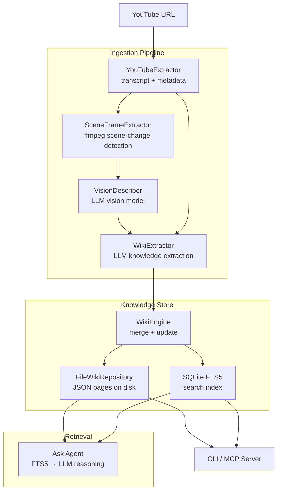
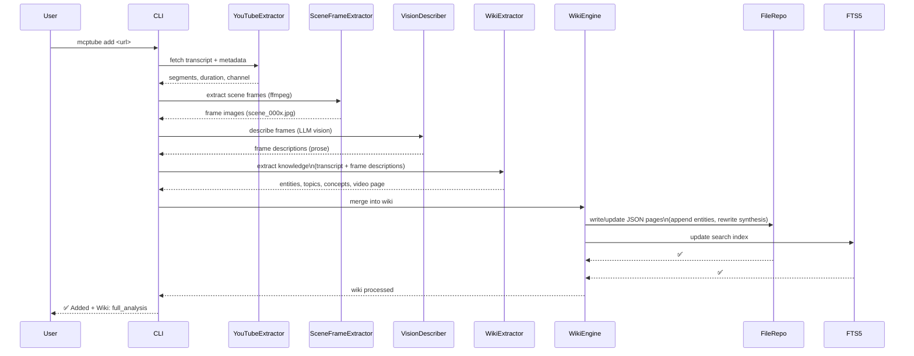
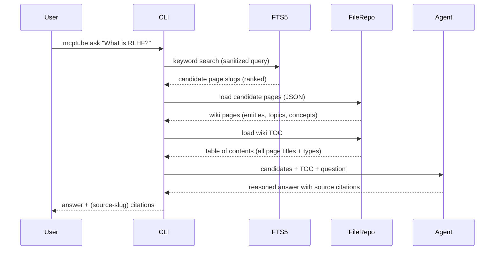

# 🎬 mcptube-vision

**YouTube video knowledge engine — transcripts, vision, and persistent wiki.**

[](https://pypi.org/project/mcptube/)
[](https://pypi.org/project/mcptube/)
[](https://opensource.org/licenses/MIT)

mcptube-vision transforms YouTube videos into a persistent, structured knowledge base using both transcripts and visual frame analysis. Built on the [Karpathy LLM Wiki](https://gist.github.com/karpathy/442a6bf555914893e9891c11519de94f) pattern: knowledge compounds with every video you add.

> **Evolved from [mcptube](https://pypi.org/project/mcptube/) v0.1** — mcptube-vision replaces semantic chunk search with a persistent wiki that gets smarter with every video ingested.

---

## 🧠 How It Works

Traditional video tools re-discover knowledge from scratch on every query. mcptube-vision is different:

```
           mcptube v0.1                    mcptube-vision
    ┌─────────────────────┐         ┌─────────────────────────┐
    │ Query → vector search│         │ Video ingested → LLM     │
    │ → raw chunks → LLM  │         │ extracts knowledge →     │
    │ → answer (from scratch│        │ wiki pages created →     │
    │   every time)        │         │ cross-references built   │
    └─────────────────────┘         │                         │
                                    │ Query → FTS5 + agent    │
                                    │ → reasons over compiled  │
                                    │   knowledge → answer     │
                                    └─────────────────────────┘
```

| | v0.1 (Video Search Engine) | vision (Video Knowledge Engine) |
|---|---|---|
| **On ingest** | Chunk transcript, embed in vector DB | LLM watches + reads, writes wiki pages |
| **On query** | Find similar chunks | Agent reasons over compiled knowledge |
| **Frames** | Timestamp or keyword extraction | Scene-change detection + vision model |
| **Cross-video** | Re-search all chunks each time | Connections already in the wiki |
| **Over time** | Library of isolated videos | Compounding knowledge base |

---

## 🏗️ Technical Architecture

mcptube-vision is built around a core insight: **video knowledge should compound, not be re-discovered**. Every architectural decision flows from this principle.

### System Overview


The system overview shows three distinct subsystems connected by a unidirectional data flow. The **Ingestion Pipeline** (left) transforms a raw YouTube URL into structured knowledge through four stages: transcript extraction, scene-change frame detection, vision-model description, and LLM-powered knowledge extraction. Each stage enriches the signal — raw video becomes text, text becomes typed knowledge objects.

The **Knowledge Store** (center) is the persistent layer. The WikiEngine applies merge semantics — deciding whether to create new pages or append to existing ones — then writes JSON files to disk and updates the FTS5 search index in parallel. These two stores serve different access patterns: files for full-page reads and exports, FTS5 for sub-millisecond keyword retrieval.

The **Retrieval** layer (right) combines both stores. The Ask Agent first narrows via FTS5, then loads full pages from disk, and finally reasons over candidates with structural awareness from the wiki TOC. The CLI and MCP Server sit alongside as thin presentation layers — they never contain business logic.


---

### Ingestion Flow



The ingestion flow is a **write-once pipeline** — LLM-heavy at ingest time, but never repeated for the same video. This is the key cost tradeoff: invest tokens upfront to build compiled knowledge, so retrieval is cheap.

The sequence shows two critical branching points. First, after transcript extraction, the pipeline forks into vision processing (scene frames → LLM vision descriptions) and feeds both streams into the WikiExtractor. This dual-signal approach means the LLM sees both what was *said* and what was *shown* — critical for content like coding tutorials or slide-based lectures where the transcript alone misses visual information.

Second, the WikiEngine merge step is where knowledge compounding happens. Rather than blindly writing new pages, it checks for existing entities, topics, and concepts — appending new video contributions to existing pages and rewriting synthesis summaries. This is why ingesting video #10 makes the wiki smarter about videos #1–9 too: shared concepts get richer synthesis with each new source.

The final FTS5 index update runs synchronously after the file write, ensuring search consistency. There is no eventual-consistency window — once `add_video` returns, all new knowledge is immediately searchable.

---

### Retrieval Flow



The retrieval flow is deliberately **two-stage** to balance cost and intelligence. The first stage — FTS5 keyword search — runs entirely locally with zero LLM tokens, narrowing thousands of wiki pages to a ranked handful in milliseconds. Query sanitization strips special characters (e.g. `?`, `!`) that would break FTS5 syntax, ensuring robustness for natural-language questions.

The second stage loads two types of context for the agent: the **candidate pages** (full detail — summaries, contributions, entity references) and the **wiki TOC** (a compact structural map of all knowledge). The TOC is critical — it gives the agent awareness of what it *doesn't* know. Without it, the agent would hallucinate answers from weak matches. With it, the agent can reason: "The wiki has pages on RLHF and scaling laws, but nothing on quantum computing — so I should say I don't have that information."

In CLI mode (BYOK), the agent is an LLM call that synthesizes the final answer with source citations. In MCP server mode (passthrough), this stage returns the raw candidates and TOC to the client — letting the client's own model (Copilot, Claude, Gemini) do the reasoning. This dual-mode design means the server never requires an API key when used via MCP.

---

### Subsystem Breakdown

#### 1. Ingestion Pipeline

**YouTubeExtractor** pulls transcript segments via `youtube-transcript-api` and video metadata via `yt-dlp`. Transcripts are chunked by natural segment boundaries, not fixed token windows — preserving semantic coherence.

**SceneFrameExtractor** uses ffmpeg's perceptual scene-change filter (`select='gt(scene,{threshold})'`) rather than fixed-interval sampling. This is deliberate: fixed intervals waste tokens on static frames (slides held for 30s), while scene-change detection captures *transitions* — the moments of highest information density. The threshold (default `0.4`) is configurable.

**VisionDescriber** sends detected frames to a vision-capable LLM (GPT-4o, Claude, Gemini — auto-detected via API key priority). Frame descriptions are plain prose, not structured JSON, to maximise the LLM's descriptive latitude.

**Why this matters:** A transcript of a coding tutorial misses the code on screen. Scene-change vision capture recovers that signal without the token cost of dense fixed-interval sampling.

---

#### 2. WikiEngine — The Novel Core ⭐

Inspired by the [Karpathy LLM Wiki pattern](https://gist.github.com/karpathy/442a6bf555914893e9891c11519de94f), this is the most architecturally distinctive component.

**WikiExtractor** takes the combined transcript + frame descriptions and prompts an LLM to extract four typed knowledge objects:

| Type | Semantics | Update Policy |
|------|-----------|---------------|
| `video` | Immutable per-video summary + timestamps | Write-once |
| `entity` | People, tools, companies | Append-only — new references added, never overwritten |
| `topic` | Broad themes (e.g. "Scaling Laws") | Synthesis rewritten; per-video contributions immutable |
| `concept` | Specific ideas (e.g. "RLHF") | Synthesis rewritten; per-video contributions immutable |

**WikiEngine** handles merge semantics — when a new video references an existing entity or concept, it integrates the new evidence without destroying prior contributions. This is a **CRDT-like append model** for knowledge, not a vector store replacement index.

**Why this matters:** Vector stores are retrieval indexes — they don't synthesize. Two videos about "attention mechanisms" produce two isolated chunks. The WikiEngine merges them into a single `concept-attention-mechanisms` page with a synthesis that evolves as evidence accumulates. Knowledge compounds.

Version history is maintained for all non-immutable pages — every synthesis rewrite is snapshotted, enabling full auditability.

---

#### 3. Storage Layer

**FileWikiRepository** stores wiki pages as JSON on disk, one file per page. Chosen over a document DB deliberately:
- Human-readable and git-diffable
- Trivially exportable to markdown/HTML
- Schema evolution without migrations

**SQLite FTS5** maintains a parallel search index over page titles, tags, and content. Chosen over a vector store because:
- Zero embedding cost at query time
- Deterministic, auditable results
- Sub-millisecond latency at thousands of pages

**Why not ChromaDB/Pinecone?** At wiki scale, BM25-style keyword search over *compiled knowledge pages* outperforms semantic similarity over *raw chunks* — the wiki pages are already semantically rich by construction.

---

#### 4. Hybrid Retrieval Agent ⭐

The `ask` command uses a deliberate two-stage pattern:

1. **FTS5 keyword search** — narrows the full wiki to a small candidate set (milliseconds, zero LLM cost)
2. **LLM agent** — receives candidates + the wiki table of contents, reasons about relevance, synthesizes a grounded answer with source citations

**Why this matters over RAG:** Standard RAG retrieves chunks and generates. The agent here retrieves *compiled knowledge pages* and *reasons*. The wiki TOC gives the agent structural awareness of what knowledge exists — enabling it to correctly say "I don't have information about X" rather than hallucinating from weak chunk matches.

---

#### 5. MCP Server

Exposes all subsystems as tools consumable by any MCP-compatible client. Report and synthesis tools use a **passthrough pattern** — returning structured data for the client's own LLM to analyse, rather than making a second LLM call server-side. This avoids double-billing and lets the client model apply its own reasoning style.

---

### Key Design Decisions

| Decision | Alternative Considered | Reason |
|----------|----------------------|--------|
| Scene-change frame extraction | Fixed-interval sampling | Higher signal/token ratio |
| Wiki knowledge model | Vector store chunks | Knowledge compounds; no re-discovery per query |
| FTS5 retrieval | Embedding similarity | Compiled wiki pages are already semantic |
| File-based wiki storage | SQLite/document DB | Human-readable, git-diffable, zero migrations |
| Append-only entity updates | Full rewrite | Source attribution preserved; full auditability |
| Passthrough MCP reports | Server-side LLM | Avoids double-billing; client model reasons |

---

## ✨ Features

| Feature | CLI | MCP Server |
|---------|:---:|:----------:|
| Add/remove YouTube videos | ✅ | ✅ |
| Wiki knowledge base (auto-built) | ✅ | ✅ |
| Scene-change frame extraction + vision analysis | ✅ | ✅ |
| Full-text wiki search (FTS5) | ✅ | ✅ |
| Agentic Q&A over wiki | ✅ | ✅ |
| Browse wiki pages (entities, topics, concepts) | ✅ | ✅ |
| Wiki version history | ✅ | ✅ |
| Wiki export (markdown, HTML) | ✅ | — |
| Illustrated reports (single & cross-video) | ✅ (BYOK) | ✅ (passthrough) |
| YouTube discovery + clustering | ✅ (BYOK) | ✅ |
| Cross-video synthesis | ✅ (BYOK) | ✅ (passthrough) |
| Text-only processing mode | ✅ | ✅ |

**BYOK** = Bring Your Own Key (Anthropic, OpenAI, or Google)
**Passthrough** = The MCP client's own LLM does the analysis

---

## 📦 Installation

### Prerequisites

- **Python 3.12 or 3.13**
- **ffmpeg** — required for frame extraction ([install guide](https://ffmpeg.org/download.html))

### Recommended: pipx

```bash
pipx install mcptube --python python3.12
```

### Alternative: pip

```bash
python3.12 -m venv venv
source venv/bin/activate
pip install mcptube
```

### Verify installation

```bash
mcptube --help
```

---

## 🚀 Quick Start

```bash
# 1. Add a video (builds wiki automatically)
mcptube add "https://www.youtube.com/watch?v=dQw4w9WgXcQ"

# 2. Add with text-only processing (cheaper, faster)
mcptube add "https://www.youtube.com/watch?v=abc123" --text-only

# 3. Browse the wiki
mcptube wiki list
mcptube wiki show "video-dQw4w9WgXcQ"

# 4. Search the knowledge base
mcptube search "main topic"

# 5. Ask a question (agentic retrieval over wiki)
mcptube ask "What are the key ideas discussed?"

# 6. View the table of contents
mcptube wiki toc
```

> 💡 **Always wrap multi-word arguments in double quotes.**

---
## 📖 CLI Reference

### Library Management

| Command | Description | Example |
|---------|-------------|---------|
| `mcptube add "<url>"` | Ingest video + build wiki (full analysis) | `mcptube add "https://youtu.be/dQw4w9WgXcQ"` |
| `mcptube add "<url>" --text-only` | Ingest without vision processing | `mcptube add "https://youtu.be/abc" --text-only` |
| `mcptube list` | List all videos with tags | `mcptube list` |
| `mcptube info <query>` | Show full video details (transcript, chapters) | `mcptube info 1` |
| `mcptube remove <query>` | Remove video + clean wiki references | `mcptube remove 1` |

> `<query>` can be a video index number, video ID, or partial title.

---

### Wiki Knowledge Base

| Command | Description | Example |
|---------|-------------|---------|
| `mcptube wiki list` | Browse all wiki pages | `mcptube wiki list` |
| `mcptube wiki list --type <type>` | Filter by type: `video`, `entity`, `topic`, `concept` | `mcptube wiki list --type concept` |
| `mcptube wiki list --tag <tag>` | Filter by tag | `mcptube wiki list --tag AI` |
| `mcptube wiki show <slug>` | Read a specific wiki page in full | `mcptube wiki show "entity-openai"` |
| `mcptube wiki search "<query>"` | Full-text search across all wiki pages | `mcptube wiki search "attention"` |
| `mcptube wiki toc` | Table of contents (all pages, compact) | `mcptube wiki toc` |
| `mcptube wiki history <slug>` | Version history for a wiki page | `mcptube wiki history "topic-ml"` |
| `mcptube wiki export` | Export all pages as markdown (default) | `mcptube wiki export -o wiki_export/` |
| `mcptube wiki export --format html` | Export all pages as single HTML file | `mcptube wiki export --format html -o wiki.html` |
| `mcptube wiki export --page <slug>` | Export a single page | `mcptube wiki export --page "entity-openai" -o openai.md` |

---

### Search & Ask

| Command | Description | Example |
|---------|-------------|---------|
| `mcptube search "<query>"` | Full-text search, returns page list | `mcptube search "transformers"` |
| `mcptube ask "<question>"` | Agentic Q&A over wiki (BYOK) | `mcptube ask "What is self-attention?"` |

---

### Frames

| Command | Description | Example |
|---------|-------------|---------|
| `mcptube frame <query> <timestamp>` | Extract frame at exact timestamp (seconds) | `mcptube frame 1 30.5` |
| `mcptube frame-query <query> "<description>"` | Extract frame by transcript match | `mcptube frame-query 1 "when they show the diagram"` |

---

### Analysis & Reports (BYOK)

| Command | Description | Example |
|---------|-------------|---------|
| `mcptube classify <query>` | LLM classify + tag a video | `mcptube classify 1` |
| `mcptube report <query>` | Generate illustrated report for one video | `mcptube report 1` |
| `mcptube report <query> --focus "<topic>"` | Guide report with a focus query | `mcptube report 1 --focus "RLHF"` |
| `mcptube report <query> --format html -o <file>` | Save report as HTML | `mcptube report 1 --format html -o report.html` |
| `mcptube report-query "<topic>"` | Cross-video report on a topic | `mcptube report-query "scaling laws"` |
| `mcptube report-query "<topic>" --tag <tag>` | Cross-video report filtered by tag | `mcptube report-query "AI" --tag research` |
| `mcptube report-query "<topic>" -o <file>` | Save cross-video report | `mcptube report-query "AI" --format html -o report.html` |
| `mcptube synthesize-cmd "<topic>" -v <id> -v <id>` | Cross-video theme synthesis | `mcptube synthesize-cmd "RLHF" -v id1 -v id2` |
| `mcptube synthesize-cmd "<topic>" -v <id> --format html -o <file>` | Save synthesis as HTML | `mcptube synthesize-cmd "AI" -v id1 --format html -o out.html` |
| `mcptube discover "<topic>"` | Search YouTube, cluster results (no ingest) | `mcptube discover "prompt engineering"` |

---

### Server

| Command | Description |
|---------|-------------|
| `mcptube serve` | Start MCP server over HTTP (default `127.0.0.1:9093`) |
| `mcptube serve --stdio` | Start MCP server over stdio (for Claude Desktop) |
| `mcptube serve --host <host> --port <port>` | Custom host/port |
| `mcptube serve --reload` | Hot-reload mode for development |


---

## 🧩 Wiki Page Types

When you ingest a video, mcptube-vision builds four types of wiki pages:

| Page Type | Created From | Update Policy |
|-----------|-------------|---------------|
| **Video** | Each ingested video | Write-once (immutable) |
| **Entity** | People, companies, tools mentioned | Append-only (new references added) |
| **Topic** | Broad themes (e.g., "Machine Learning") | Synthesis rewritten, per-video contributions immutable |
| **Concept** | Specific ideas (e.g., "Scaling Laws") | Synthesis rewritten, per-video contributions immutable |

**Principle:** Raw source content (what was said/shown in each video) is never modified. Only synthesis summaries evolve as new videos are added. Version history is maintained for all changes.

---

## 🔍 How Search Works (Hybrid Retrieval)

mcptube-vision uses a two-step hybrid approach:

1. **SQLite FTS5** — keyword search narrows thousands of wiki pages to a handful of candidates (milliseconds, zero LLM cost)
2. **LLM Agent** — reads candidates + wiki table of contents, reasons about relevance, synthesizes an answer

This gives you the speed of keyword search with the intelligence of an LLM agent.

---

## 👁️ Vision Pipeline

When you ingest a video without `--text-only`, mcptube-vision:

1. Extracts key frames using **ffmpeg scene-change detection** (`select='gt(scene,0.4)'`)
2. Sends frames to a **vision-capable LLM** (GPT-4o, Claude, Gemini) for description
3. Combines frame descriptions with transcript in the knowledge extraction pass

This captures visual content (slides, code, diagrams, demos) that transcripts alone miss.

---

## 🔌 MCP Client Setup

mcptube exposes 25+ MCP tools via two transports:

| Transport | How it works | Used by |
|-----------|-------------|---------|
| **Streamable HTTP** (`/mcp`) | Client connects to a running mcptube server | VS Code, Claude Code, Cursor, Windsurf, Codex, Gemini CLI |
| **stdio** | MCP client spawns `mcptube` as a child process | Claude Desktop |

> ℹ️ The MCP server is currently available for **local use only**. You must run `mcptube serve` locally or let the client spawn it.

---

### VS Code + GitHub Copilot ✅ Tested

Open `Cmd+Shift+P` → **MCP: Open User Configuration** and add:

```json
{
  "servers": {
    "mcptube": {
      "url": "http://127.0.0.1:9093/mcp"
    }
  }
}
```

Then start the server in a terminal:

```bash
mcptube serve
```

---

### Claude Code ✅ Tested

```bash
claude mcp add mcptube --transport http http://127.0.0.1:9093/mcp
```

Then start the server in a separate terminal:

```bash
mcptube serve
```

---

### Claude Desktop

Edit `~/Library/Application Support/Claude/claude_desktop_config.json` (macOS) or `%APPDATA%\Claude\claude_desktop_config.json` (Windows):

**If installed via `pipx` (recommended):**

```json
{
  "mcpServers": {
    "mcptube": {
      "command": "mcptube",
      "args": ["serve", "--stdio"]
    }
  }
}
```

**If installed in a virtual environment:**

```json
{
  "mcpServers": {
    "mcptube": {
      "command": "/full/path/to/.venv/bin/mcptube",
      "args": ["serve", "--stdio"]
    }
  }
}
```

No separate server needed — Claude Desktop spawns the process automatically.

---

### Cursor

Create or edit `~/.cursor/mcp.json` (global) or `.cursor/mcp.json` (project-scoped):

```json
{
  "mcpServers": {
    "mcptube": {
      "url": "http://127.0.0.1:9093/mcp"
    }
  }
}
```

Then start the server:

```bash
mcptube serve
```

---

### Windsurf

Edit `~/.codeium/windsurf/mcp_config.json`:

```json
{
  "mcpServers": {
    "mcptube": {
      "serverUrl": "http://127.0.0.1:9093/mcp"
    }
  }
}
```

Then start the server:

```bash
mcptube serve
```

---

### OpenAI Codex

Edit `~/.codex/config.toml`:

```toml
[mcp_servers.mcptube]
url = "http://127.0.0.1:9093/mcp"
```

Then start the server:

```bash
mcptube serve
```

---

### Gemini CLI

Edit `~/.gemini/settings.json`:

```json
{
  "mcpServers": {
    "mcptube": {
      "httpUrl": "http://127.0.0.1:9093/mcp"
    }
  }
}
```

Then start the server:

```bash
mcptube serve
```

---

### Verify Connection

Once connected, ask your MCP client:

> use mcptube. list all videos in my library

It should call the `list_videos` tool and return results.


### MCP Tools

| Tool | Description |
|------|-------------|
| `add_video` | Ingest video + build wiki |
| `list_videos` | List library |
| `remove_video` | Remove video + clean wiki |
| `wiki_list` | Browse wiki pages |
| `wiki_show` | Read a wiki page |
| `wiki_search` | Full-text search |
| `wiki_toc` | Table of contents |
| `wiki_ask` | Agentic Q&A |
| `wiki_history` | Version history |
| `get_frame` | Extract frame (inline image) |
| `get_frame_by_query` | Frame by transcript match |
| `classify_video` | Get metadata for classification |
| `generate_report` | Get data for single-video report |
| `generate_report_from_query` | Get data for cross-video report |
| `synthesize` | Get data for theme synthesis |
| `discover_videos` | Search YouTube |
| `ask_video` | Single-video Q&A data |
| `ask_videos` | Multi-video Q&A data |

---

## ⚙️ Configuration

All settings can be overridden via environment variables prefixed with `MCPTUBE_`:

| Setting | Default | Env Var |
|---------|---------|---------|
| Data directory | `~/.mcptube` | `MCPTUBE_DATA_DIR` |
| Server host | `127.0.0.1` | `MCPTUBE_HOST` |
| Server port | `9093` | `MCPTUBE_PORT` |
| Default LLM model | `gpt-4o` | `MCPTUBE_DEFAULT_MODEL` |

### BYOK API Keys

Set one or more to enable LLM features:

```bash
export ANTHROPIC_API_KEY="sk-ant-..."
export OPENAI_API_KEY="sk-..."
export GOOGLE_API_KEY="AI..."
```

Auto-detection priority: Anthropic → OpenAI → Google.

---

## 📁 Data Layout

```
~/.mcptube/
├── mcptube.db          # Video metadata (SQLite)
├── wiki.db             # FTS5 search index (SQLite)
├── wiki/
│   ├── video/          # Video pages (JSON)
│   ├── entity/         # Entity pages (JSON)
│   ├── topic/          # Topic pages (JSON)
│   ├── concept/        # Concept pages (JSON)
│   └── _history/       # Version history
└── frames/
    ├── <id>_<ts>.jpg   # Single extracted frames
    └── <id>_scenes/    # Scene-change frames + metadata
```

---

## 🧪 Development

```bash
git clone https://github.com/0xchamin/mcptube.git
cd mcptube
git checkout vision
python3.12 -m venv venv
source venv/bin/activate
pip install -e ".[dev]"
pytest
```

---

## 🗺️ Roadmap

- [x] Wiki knowledge engine (entities, topics, concepts)
- [x] Scene-change frame extraction + vision analysis
- [x] Hybrid retrieval (FTS5 + agentic)
- [x] CLI + MCP server
- [ ] Playlist/series support
- [ ] Web app with early access sign-up
- [ ] Token-based payment integration

---

## 📄 License

MIT — see [LICENSE](LICENSE) for details.
